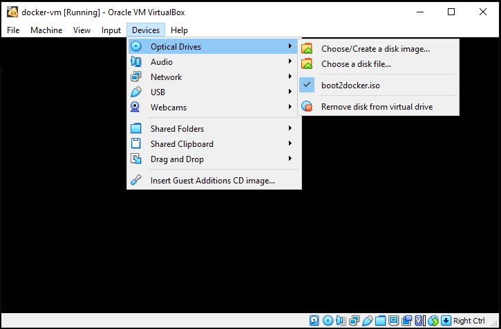

# Docker Desktop on Windows.

*Download* **boot2docker.iso** from [boot2docker release page](https://github.com/boot2docker/boot2docker/releases)

# Create a virtual machine
* as docker-vm
* with 4GB of ram 
* 100GB of dynamically allocated vmdk hdd.
* additional Host-Only adaptor
* a shared folder to save docker data outside of vm.
  
  
  

# Start docker-vm

* Mount boot2docker.iso

  

# Restart docker-vm

  

# Get IP Address
* Type *ifconfig* and press Enter.

  

# Open super-putty
* Enter Host as the **ip address** from previous step.
* Enter Login as **docker**
* Enter Password as **tcuser**
* Enter **sudo -i** to login as *root*

  

# Done